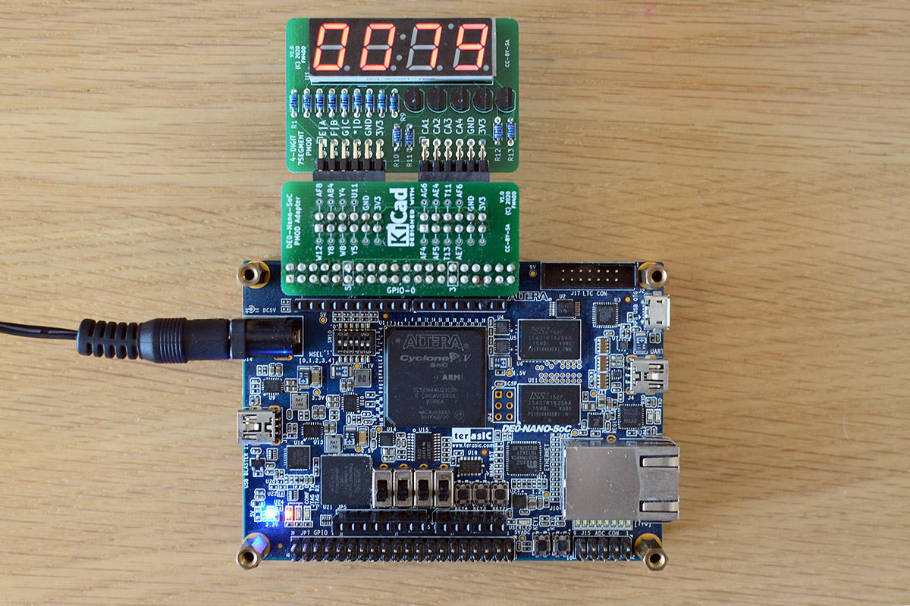

## 7SEG4 PMOD

### Description


This PMOD provides a multiplexed four-digit 7-segment LED display output to FPGA designs via two double-row PMOD ports (quad-row).
The 7-segment display type “common anode” requires to use inverse logic. With inverse logic, setting the output “LOW” lights up the LED segment. Each digit has its own common anode, but the seven LED segments are shared. To display separate numbers on each digit, the program cycles through each anode with the apropriate segments enabled for this digit.

http://fpga.fm4dd.com/

### Schematic
[](images/7seg4-schema.png)

### PCB Gerber
[7SEG4 PMOD Gerber V1.1](20200130-7seg4-gerber-v11.zip)

### Pin Assignments

#### IceBreaker v1.0

 J1# |  Label | Description   | PMOD1A
-----|--------|---------------|-------
1    |  A     | LED Segment A | 4
2    |  B     | LED Segment B | 2
3    |  C     | LED Segment C | 47
4    |  D     | LED Segment D | 45
7    |  E     | LED Segment E | 3
8    |  F     | LED Segment F | 48
9    |  G     | LED Segment G | 46
10   |  DP    | LED Segment DP| 44

 J2# |  Label | Description      | PMOD1B
-----|--------|------------------|-------
1    |  CA1   | Common AN Digit1 | 43
2    |  CA2   | Common AN Digit2 | 38
3    |  CA3   | Common AN Digit3 | 34
4    |  CA4   | Common AN Digit4 | 31
7    |  -     | Not connected    | 42
8    |  -     | Not connected    | 36
9    |  -     | Not connected    | 32
10   |  CA5   | Common AN Colon  | 28

#### DE0-Nano-SoC

The connection to Intels DE0-Nano-SoC is made through the pmod2nano adapter.


 J1# |  Label | Description    | GPIO0A | GPIO1A
-----|--------|----------------|--------|--------
1    |  E     |  LED Segment E | PIN_W12|PIN_AA15
2    |  F     |  LED Segment F | PIN_Y8 |PIN_AG26
3    |  G     |  LED Segment G | PIN_W8 |PIN_AF23
4    |  *     |  LED Segment DP| PIN_Y5 |PIN_AF21
7    |  A     |  LED Segment A | PIN_AF8|PIN_AH27
8    |  B     |  LED Segment B | PIN_AB4|PIN_AH24
9    |  C     |  LED Segment C | PIN_Y4 |PIN_AE22
10   |  D     |  LED Segment D | PIN_U11|PIN_AG20

 J2# |  Label | Description      | GPIO0B | GPIO1B
-----|--------|------------------|--------|--------
1    |  -     | Not connected    | PIN_AF4| PIN_AH23
2    |  -     | Not connected    | PIN_AF5| PIN_AE19
3    |  -     | Not connected    | PIN_T13| PIN_AD19
4    |  CA5   | Common AN DP     | PIN_AE7| PIN_AE24
7    |  CA1   | Common AN Digit1 | PIN_AG6| PIN_AG23
8    |  CA2   | Common AN Digit2 | PIN_AE4| PIN_AF18
9    |  CA3   | Common AN Digit3 | PIN_T11| PIN_AE20
10   |  CA4   | Common AN Digit4 | PIN_AF6| PIN_AD20

### Example


7SEG4 PMOD, connected to a Icebreaker v1.0 board

#### Verilog

Verilog test program pmod_7seg4_1.v (top-level):
```
// -------------------------------------------------------
// This program is a decimal counter 0..9999, displayed on
// the 4-digit 7-segment display. Counts in 1Hz intervals.
// 12MHz clock: set breakpoint at 23'd5999999 (icebreaker)
// 50MHz clock: set breakpoint at 25'd24999999 (de0-nano)
// -------------------------------------------------------
module pmod_7seg4_1 (
  input clk,
  output seg_a,
  output seg_b,
  output seg_c,
  output seg_d,
  output seg_e,
  output seg_f,
  output seg_g,
  output seg_dp,
  output ca1,
  output ca2,
  output ca3,
  output ca4
);

  reg clk_1hz = 1'b0;
  reg [22:0] clk_count = 23'd0;
  reg [3:0] DIGIT;
  reg [7:0] SEG;
  assign {seg_dp, seg_g, seg_f, seg_e, seg_d, seg_c, seg_b, seg_a} = SEG;
  assign {ca1, ca2, ca3, ca4} = DIGIT;
  reg [3:0] units, tens, hundreds, thousands;

  display_7seg display(.CLK (clk), .units (units), .tens (tens), .hundreds (hundreds), .thousands (thousands), .SEG (SEG), .DIGIT (DIGIT));

  always @(posedge clk)
  begin
    clk_count   <= clk_count + 1;
    if(clk_count == 23'd5999999)
    begin
      clk_count   <= 0;
      clk_1hz <= ~clk_1hz;
    end
  end

  always @(posedge clk_1hz)
  begin
    units <= units + 1;
    if (units == 9)
    begin
      units <= 0;
      tens <= tens + 1;
      if (tens == 9)
      begin
        tens <= 0;
        hundreds <= hundreds + 1;
        if (hundreds == 9)
        begin
          hundreds <= 0;
          thousands <= thousands + 1;
          if(thousands == 9)
          begin
            thousands <= 0;
          end
        end
      end
    end
  end
endmodule // end top-level module

// -------------------------------------------------------
// module display_7seg converts 4 decimal digits to 7-seg
// -------------------------------------------------------
module display_7seg(
  input CLK,
  input [3:0] units, tens, hundreds, thousands,
  output [7:0] SEG,
  output [3:0] DIGIT
);

  reg [3:0] digit_data;
  reg [1:0] digit_posn;
  reg [23:0] prescaler;

  encode_7seg encode(.CLK (CLK), .SEG (SEG), .D (digit_data));

  always @(posedge CLK)
  begin
    prescaler <= prescaler + 24'd1;
    if (prescaler == 24'd50000)     // set 1kHz multiplex frequency
    begin
      prescaler <= 0;               // reset the prescaler to zero
      digit_posn <= digit_posn + 2'd1;
      if (digit_posn == 0)
      begin
        digit_data <= units;       // assign digit_data
        DIGIT <= 4'b1110;          // set the 1 digit pin low (enable)
      end
      if (digit_posn == 2'd1)
      begin
        digit_data <= tens;        // assign digit_data to show tens
        DIGIT <= 4'b1101;          // set the 2 digit pin low (enable)
      end
      if (digit_posn == 2'd2)
      begin
        digit_data <= hundreds;    // assign digit_data to show hundreds
        DIGIT <= 4'b1011;          // set the 3 digit pin low (enable)
      end
      if (digit_posn == 2'd3)
      begin
        digit_data <= thousands;   // assign digit_data to show thousands
        DIGIT <= 4'b0111;          // set the 4 digit pin low (enable)
        digit_posn <= 0;           // reset position counter after 4nd digit
      end
    end
  end
endmodule
  
  
// -------------------------------------------------------
// module encode_7seg encodes a bin number as a 7seg digit
// -------------------------------------------------------
module encode_7seg(
  input CLK,
  input [3:0] D,
  output reg [7:0] SEG
);
  
  always @(posedge CLK)
    begin
      case(D)
        //              PGFEDCBA
        4'd0: SEG <= 8'b11000000;
        4'd1: SEG <= 8'b11111001;
        4'd2: SEG <= 8'b10100100;
        4'd3: SEG <= 8'b10110000;
        4'd4: SEG <= 8'b10011001;
        4'd5: SEG <= 8'b10010010;
        4'd6: SEG <= 8'b10000010;
        4'd7: SEG <= 8'b11111000;
        4'd8: SEG <= 8'b10000000;
        4'd9: SEG <= 8'b10010000;
        default: SEG <= 8'b11111111;
      endcase
    end
endmodule
```

#### VHDL

The Verilog example program pmod_7seg4_1.v converted to VHDL as pmod_7seg4_2.vhd:

```
-- -------------------------------------------------------
-- This program is a decimal counter 0..9999, displayed on
-- the 4-digit 7-segment display. Counts in 1Hz intervals.
-- -------------------------------------------------------
library ieee;
use ieee.std_logic_1164.all;
use ieee.numeric_std.all;

entity pmod_7seg4_2 is
port ( clk: in STD_LOGIC;
     seg_a: out STD_LOGIC := '1';
     seg_b: out STD_LOGIC := '1';
     seg_c: out STD_LOGIC := '1';
     seg_d: out STD_LOGIC := '1';
     seg_e: out STD_LOGIC := '1';
     seg_f: out STD_LOGIC := '1';
     seg_g: out STD_LOGIC := '1';
    seg_dp: out STD_LOGIC := '1';
       ca1: out STD_LOGIC := '1';
       ca2: out STD_LOGIC := '1';
       ca3: out STD_LOGIC := '1';
       ca4: out STD_LOGIC := '1'
);
end pmod_7seg4_2;

architecture arch of pmod_7seg4_2 is
  signal   clk_1hz: STD_LOGIC;
  signal     DIGIT: STD_LOGIC_VECTOR(3 downto 0);
  signal       SEG: STD_LOGIC_VECTOR(7 downto 0);
  signal unit, tens, hundreds, thousands: INTEGER range 0 to 9;

  -- -------------------------
  -- interface to display_7seg
  -- -------------------------
  component display_7seg is
  port ( CLK: IN  STD_LOGIC;
      unit, tens, hundreds, thousands: IN INTEGER := 0;  --digit values
     DIGIT:     OUT STD_LOGIC_VECTOR(3 DOWNTO 0);        --output digit number
                 SEG:   OUT STD_LOGIC_VECTOR(7 DOWNTO 0) --output segments
  );
  end component;

begin
  -- instantiation and value assignment to display_7seg
  display: display_7seg
  port map( clk, unit, tens, hundreds, thousands, DIGIT, SEG );

  counter_p: process( clk, clk_1hz, unit, tens, hundreds, thousands, DIGIT, SEG )
  variable clk_count: INTEGER := 0;

  begin
    if( rising_edge(clk) ) then
    clk_count := clk_count + 1;
      if( clk_count = 24999999 ) then
        clk_count := 0;
        clk_1hz <= NOT clk_1hz;
      end if;
    end if;

    if( rising_edge(clk_1hz) ) then
      unit <= unit + 1;
      if ( unit = 9 ) then
        unit <= 0;
        tens <= tens + 1;
        if ( tens = 9 ) then
          tens <= 0;
          hundreds <= hundreds + 1;
          if ( hundreds = 9 ) then
            hundreds <= 0;
            thousands <= thousands + 1;
            if( thousands = 9 ) then
              thousands <= 0;
            end if;
          end if;
        end if;
      end if;
    end if;
  end process counter_p;

  ca1 <= DIGIT(3);
  ca2 <= DIGIT(2);
  ca3 <= DIGIT(1);
  ca4 <= DIGIT(0);
  seg_a <= SEG(0);
  seg_b <= SEG(1);
  seg_c <= SEG(2);
  seg_d <= SEG(3);
  seg_e <= SEG(4);
  seg_f <= SEG(5);
  seg_g <= SEG(6);
  seg_dp <= SEG(7);
end arch;

-- -------------------------------------------------------
-- entity display_7seg converts 4 decimal digits to 7-seg
-- -------------------------------------------------------
library ieee;
use ieee.std_logic_1164.all;
use ieee.numeric_std.all;

entity display_7seg is
port ( CLK: IN  STD_LOGIC;
      unit: IN INTEGER;
      tens: IN INTEGER;
  hundreds: IN INTEGER;
 thousands: IN INTEGER;
     DIGIT: OUT STD_LOGIC_VECTOR(3 DOWNTO 0);  --output digit number
       SEG: OUT STD_LOGIC_VECTOR(7 DOWNTO 0)   --output segments
);
end display_7seg;

architecture arch of display_7seg is
  signal digit_data: INTEGER;
  -- ------------------------
  -- interface to encode_7seg
  -- ------------------------
  component encode_7seg is
  port( D: IN  INTEGER range 0 to 9;           --digit value input
      SEG: OUT STD_LOGIC_VECTOR(7 DOWNTO 0)    --output to segments
  );
  end component;

begin
  -- instantiation and value assignment to encode_7seg
  encode: encode_7seg port map( digit_data, SEG );

  display: process( clk )
  variable digit_posn: INTEGER range 0 to 3 := 0;
  variable  prescaler: INTEGER := 0;

  begin
  if( rising_edge(clk) ) then
    prescaler := prescaler + 1;
    if( prescaler = 50000 ) then -- 1ms refresh
      prescaler := 0;
      if (digit_posn = 0) then
        digit_data <= unit;      -- assign digit_data
        DIGIT <= "1110";         -- set the 1 digit pin low (enable)
      end if;
      if (digit_posn = 1) then
        digit_data <= tens;      -- assign digit_data to show tens
        DIGIT <= "1101";         -- set the 2 digit pin low (enable)
      end if;
      if (digit_posn = 2) then
        digit_data <= hundreds;  -- assign digit_data to show hundreds
        DIGIT <= "1011";         -- set the 3 digit pin low (enable)
      end if;
      if (digit_posn = 3) then
        digit_data <= thousands; -- assign digit_data to show thousands
        DIGIT <= "0111";         -- set the 4 digit pin low (enable)
      end if;
      digit_posn := digit_posn + 1;
    end if;
  end if;
  end process display;
end arch;

-- -------------------------------------------------------
-- entity encode_7seg encodes a bin number as a 7seg digit
-- -------------------------------------------------------
library ieee;
use ieee.std_logic_1164.all;
use ieee.numeric_std.all;

entity encode_7seg is
port (  D:      IN  INTEGER range 0 to 9;                 --digit value input
                SEG:    OUT STD_LOGIC_VECTOR(7 DOWNTO 0)  --output to segments
);
end encode_7seg;

architecture arch of encode_7seg is
begin
  with D select                       --map input D to segments
    SEG <= "11000000" WHEN 0,         --0
           "11111001" WHEN 1,         --1
           "10100100" WHEN 2,         --2
           "10110000" WHEN 3,         --3
           "10011001" WHEN 4,         --4
           "10010010" WHEN 5,         --5
           "10000010" WHEN 6,         --6
           "11111000" WHEN 7,         --7
           "10000000" WHEN 8,         --8
           "10010000" WHEN 9,         --9
           "11111111" WHEN OTHERS;    --default blank
end arch;
```



7SEG4 PMOD, connected to a DE0-Nano-SoC board
