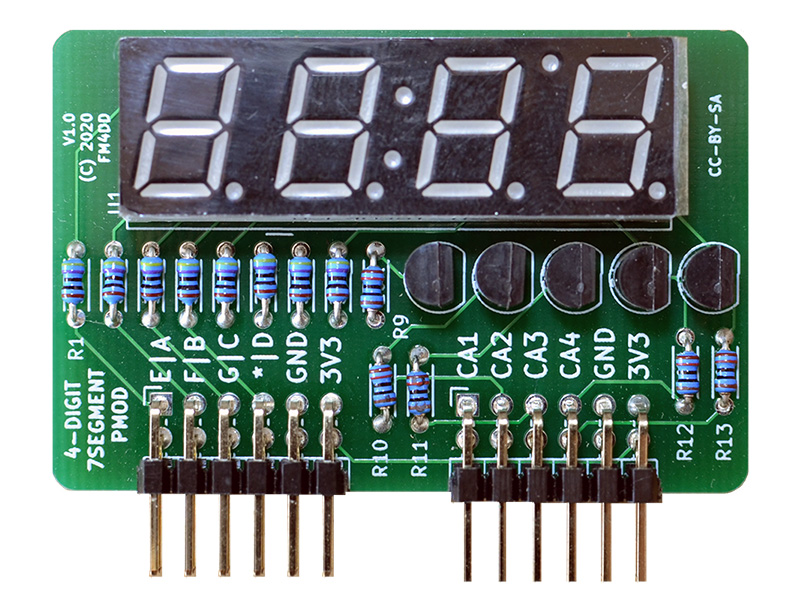
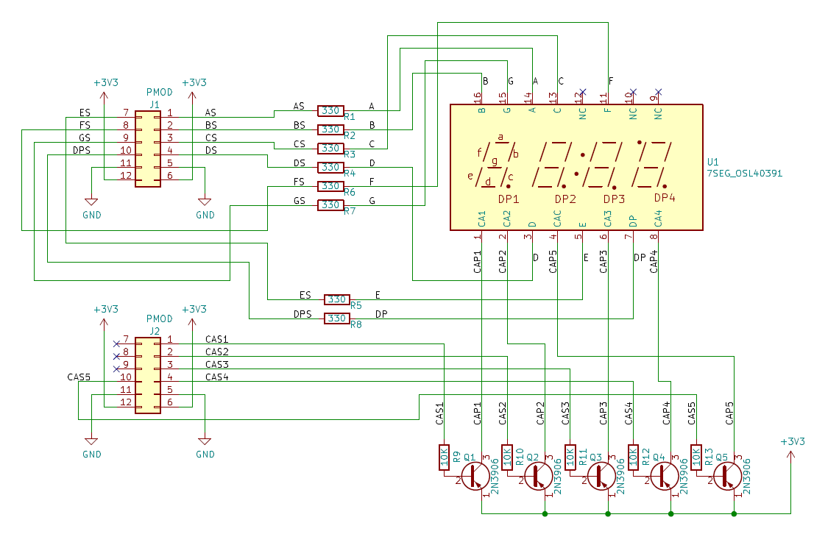
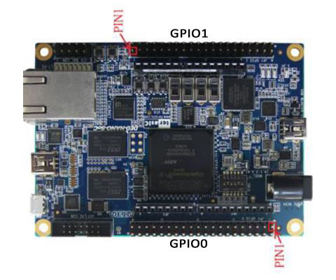
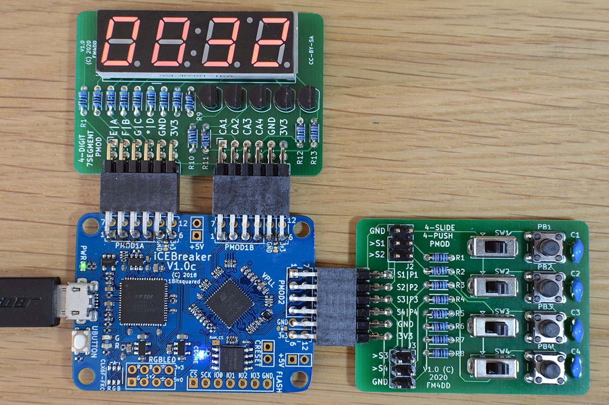

## 7SEG4 PMOD

### Description

This PMOD provides a multiplexed four-digit 7-segment LED display output to FPGA designs via two double-row PMOD ports (quad-row).
The 7-segment display type “common anode” requires to use inverse logic. With inverse logic, setting the output “LOW” lights up the LED segment. Each digit has its own common anode, but the seven LED segments are shared. To display separate numbers on each digit, the program cycles through each anode with the apropriate segments enabled for this digit.

### Schematic

### PCB Gerber
[7SEG4 PMOD Gerber V1.1](20200130-7seg4-gerber-v11.zip)

### Pin Assignments

#### IceBreaker v1.0

 J1# |  Label | Description   | PMOD1A
-----|--------|---------------|-------
1    |  A     | LED Segment A | 4
2    |  B     | LED Segment B | 2
3    |  C     | LED Segment C | 47
4    |  D     | LED Segment D | 45
7    |  E     | LED Segment E | 3
8    |  F     | LED Segment F | 48
9    |  G     | LED Segment G | 46
10   |  DP    | LED Segment DP| 44

 J2# |  Label | Description      | PMOD1B
-----|--------|------------------|-------
1    |  CA1   | Common AN Digit1 | 43
2    |  CA2   | Common AN Digit2 | 38
3    |  CA3   | Common AN Digit3 | 34
4    |  CA4   | Common AN Digit4 | 31
7    |  -     | Not connected    | 42
8    |  -     | Not connected    | 36
9    |  -     | Not connected    | 32
10   |  CA5   | Common AN Colon  | 28

#### DE0-Nano-SoC

The connection to Intels DE0-Nano-SoC is made through the pmod2nano adapter.

 J1# |  Label | Description    | GPIO0A | GPIO1A
-----|--------|----------------|--------|--------
1    |  A     |  LED Segment A | PIN_W12|PIN_AA15
2    |  B     |  LED Segment B | PIN_Y8 |PIN_AG26
3    |  C     |  LED Segment C | PIN_W8 |PIN_AF23
4    |  D     |  LED Segment D | PIN_Y5 |PIN_AF21
7    |  E     |  LED Segment E | PIN_AF8|PIN_AH27
8    |  F     |  LED Segment F | PIN_AB4|PIN_AH24
9    |  G     |  LED Segment G | PIN_Y4 |PIN_AE22
10   |  *     |  LED Segment DP| PIN_U11|PIN_AG20

 J2# |  Label | Description      | GPIO0A | GPIO1A
-----|--------|------------------|--------|--------
1    |  CA1   | Common AN Digit1 | PIN_AF4| PIN_AH23
2    |  CA2   | Common AN Digit2 | PIN_AF5| PIN_AE19
3    |  CA3   | Common AN Digit3 | PIN_T13| PIN_AD19
4    |  CA4   | Common AN Digit4 | PIN_AE7| PIN_AE24
7    |  -     | Not connected    | PIN_AG6| PIN_AG23
8    |  -     | Not connected    | PIN_AE4| PIN_AF18
9    |  -     | Not connected    | PIN_T11| PIN_AE20
10   |  CA5   | Common AN Colon  | PIN_AF6| PIN_AD20

### Example

7SEG4 PMOD, connected to a Icebreaker v1.0 board
